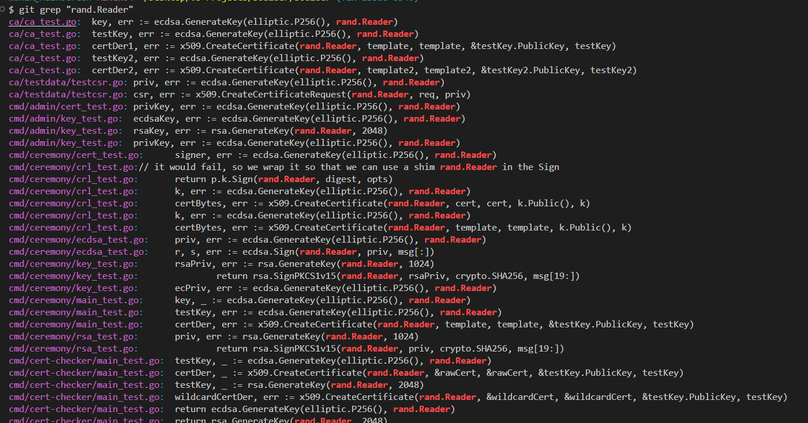

# Contribution #1: go1.26: remove crypto/rand.Reader argument from all keygen and signing calls

**Contribution Number:** 1
**Student:** Mahin Khandker
**Issue:** https://github.com/letsencrypt/boulder/issues/8540
**Fork:** https://github.com/mkhandker19/boulder
**Status:** Phase II — Complete

---

## Why I Chose This Issue

I chose this issue because it offers a well-scoped, clearly defined task that fits within the 3–4 week timeline of the CodePath AI 301 Open Source Capstone program. The issue involves a Go language modernization task — replacing a now-deprecated `crypto/rand.Reader` argument with `nil` across all keygen and signing call sites in the Boulder codebase. This is a great opportunity to get familiar with a large, real-world Go codebase without needing deep domain expertise upfront.

I also chose this issue because Let's Encrypt's Boulder is one of the most impactful open-source projects in internet security infrastructure. Even a cleanup contribution like this one is meaningful in a security-critical codebase. Through this work, I hope to improve my Go skills, learn how to navigate a large production codebase, and gain experience following a professional open-source contribution process end-to-end.

---

## Understanding the Issue

### Problem Description

As of Go 1.26, all cryptography functions that accept a `rand.Reader` argument will ignore it and instead use a secure internal randomness source. The Boulder codebase currently passes `crypto/rand.Reader` explicitly to every keygen and signing call. Since Go 1.26 makes this argument obsolete, it should be replaced with `nil` at all call sites to keep the code clean and aligned with the new Go standard.

### Expected Behavior

All keygen and signing function calls throughout the Boulder codebase should pass `nil` instead of `crypto/rand.Reader` as the random reader argument, reflecting the Go 1.26 change that makes the argument unnecessary.

### Current Behavior

The codebase passes `crypto/rand.Reader` explicitly to cryptographic functions such as key generation and signing calls. While this is not broken behavior, it is now redundant and should be cleaned up to match Go 1.26 conventions.

### Affected Components

- All files in the Boulder codebase that call keygen or signing functions with a `crypto/rand.Reader` argument
- Primarily affects cryptographic utility code and certificate authority components
- Reference: https://github.com/golang/go/issues/70942

---

## Reproduction Process

### Environment Setup

**Prerequisites installed:**

| Tool | Notes |
|------|-------|
| Go 1.22+ | Install from [go.dev/dl](https://go.dev/dl). Verify with `go version`. |
| Git 2.x+ | Verify with `git --version`. |
| VS Code | Used with the official Go extension (`golang.go`). |

**Fork & Clone:**

```bash
# Clone your fork (not the original repo)
git clone https://github.com/mkhandker19/boulder.git
cd boulder

# Add the original repo as upstream for future syncing
git remote add upstream https://github.com/letsencrypt/boulder.git

# Verify remotes
git remote -v
# origin    https://github.com/mkhandker19/boulder.git (fetch)
# origin    https://github.com/mkhandker19/boulder.git (push)
# upstream  https://github.com/letsencrypt/boulder.git (fetch)
# upstream  https://github.com/letsencrypt/boulder.git (push)
```

**Create the working branch:**

```bash
git checkout main
git pull origin main
git checkout -b fix-issue-8540
git push origin fix-issue-8540
```

---

### Steps to Reproduce

> This is a code-pattern issue, not a runtime bug. Reproduction means confirming the old `rand.Reader` pattern still exists in the codebase.

1. Navigate to the cloned repo root in the VS Code terminal.

2. Run a broad search for all `rand.Reader` usages:
   ```bash
   git grep "rand.Reader"
   ```

3. Narrow the search to key generation calls specifically:
   ```bash
   git grep "GenerateKey(rand.Reader"
   ```

4. Narrow the search to signing calls:
   ```bash
   git grep "Sign(rand.Reader"
   ```

5. Check certificate creation calls:
   ```bash
   git grep "CreateCertificate(rand.Reader"
   ```

6. Confirm the issue is still open and unresolved at:
   https://github.com/letsencrypt/boulder/issues/8540

**Expected result:** Multiple matches appear across files in `ca/`, `cmd/admin/`, `cmd/ceremony/`, and `cmd/cert-checker/` — confirming the old pattern is present and the issue has not yet been fixed.

---

### Reproduction Evidence

**Branch:** https://github.com/mkhandker19/boulder/tree/fix-issue-8540

Running `git grep "rand.Reader"` on branch `fix-issue-8540` returned matches across the following files, confirming the issue is present:

| File | Pattern Found |
|------|--------------|
| `ca/ca_test.go` | `ecdsa.GenerateKey(..., rand.Reader)`, `x509.CreateCertificate(rand.Reader, ...)` |
| `ca/testdata/testcsr.go` | `ecdsa.GenerateKey(..., rand.Reader)`, `x509.CreateCertificateRequest(rand.Reader, ...)` |
| `cmd/admin/cert_test.go` | `ecdsa.GenerateKey(..., rand.Reader)` |
| `cmd/admin/key_test.go` | `ecdsa.GenerateKey(..., rand.Reader)`, `rsa.GenerateKey(rand.Reader, ...)` |
| `cmd/ceremony/cert_test.go` | `ecdsa.GenerateKey(..., rand.Reader)` |
| `cmd/ceremony/crl_test.go` | `ecdsa.GenerateKey(...)`, `x509.CreateCertificate(rand.Reader, ...)`, `p.k.Sign(rand.Reader, ...)` |
| `cmd/ceremony/ecdsa_test.go` | `ecdsa.GenerateKey(..., rand.Reader)`, `ecdsa.Sign(rand.Reader, ...)` |
| `cmd/ceremony/key_test.go` | `rsa.GenerateKey(rand.Reader, ...)`, `rsa.SignPKCS1v15(rand.Reader, ...)` |
| `cmd/ceremony/main_test.go` | `ecdsa.GenerateKey(..., rand.Reader)`, `x509.CreateCertificate(rand.Reader, ...)` |
| `cmd/ceremony/rsa_test.go` | `rsa.GenerateKey(rand.Reader, ...)`, `rsa.SignPKCS1v15(rand.Reader, ...)` |
| `cmd/cert-checker/main_test.go` | `ecdsa.GenerateKey(..., rand.Reader)`, `rsa.GenerateKey(rand.Reader, ...)`, `x509.CreateCertificate(rand.Reader, ...)` |

**Screenshot of terminal output:**



> The screenshot above shows the full output of `git grep "rand.Reader"` run on branch `fix-issue-8540`. All `rand.Reader` occurrences are highlighted in red, confirming the issue exists across multiple packages and has not yet been resolved.

---

## Solution Approach

### Analysis

The root cause is not a bug but a code modernization need. Go 1.26 changed the behavior of cryptographic functions so that the `rand` argument is ignored in favor of a secure internal source. The fix is purely mechanical — find every call site passing `crypto/rand.Reader` to a keygen or signing function and replace it with `nil`.

### Proposed Solution

Do a codebase-wide search for `crypto/rand.Reader` usage in cryptographic function calls and replace each instance with `nil`. Remove any `crypto/rand` imports that become unused after the change. Ensure all existing tests continue to pass.

### Implementation Plan (UMPIRE)

**Understand:**
The Go 1.26 update makes the `rand.Reader` argument to cryptographic functions redundant. In Go 1.26, passing `nil` tells the stdlib to use its own secure internal randomness source (`crypto/internal/sysrand`), which cannot be overridden by application code. Boulder passes `rand.Reader` explicitly at every keygen and signing call site. Since Go 1.26 ignores this argument anyway, keeping it is misleading and creates unnecessary imports. The fix is to replace every `rand.Reader` argument in keygen and signing calls with `nil`, then remove any `crypto/rand` imports that are no longer needed.

**Match:**
This is similar to large-scale codebase refactors done in open-source Go projects when a standard library API changes. The pattern is: find all usages → categorize → replace → clean up imports → verify tests pass. Affected packages confirmed by `git grep`: `ca/`, `cmd/admin/`, `cmd/ceremony/`, `cmd/cert-checker/`.

**Plan:**
1. Run `git grep "rand.Reader"` to get the full list of affected files and line numbers.
2. Categorize each match — keygen/signing arguments get replaced with `nil`; any other uses of `rand.Reader` (e.g. stored in a struct or passed as an interface) need individual review.
3. Replace `rand.Reader` with `nil` at each confirmed keygen/signing call site.
4. Check each modified file for unused `"crypto/rand"` imports and remove them.
5. Run `gofmt -w .` to ensure formatting is clean.
6. Run `go test ./...` to confirm no tests are broken.
7. Re-run `git grep "rand.Reader"` to verify no keygen/signing instances remain.

**Implement:**
> ⏳ Phase III — not yet started. Changes will be made on branch `fix-issue-8540` and submitted as a PR from `mkhandker19/boulder : fix-issue-8540` → `letsencrypt/boulder : main`.

**Review:**
- [ ] Read `CONTRIBUTING.md` in boulder for PR format requirements
- [ ] Confirm PR description references the issue (`Fixes #8540`)
- [ ] Only keygen/signing `rand.Reader` arguments are replaced — no unrelated changes
- [ ] All imports compile cleanly with no `imported and not used` errors
- [ ] `gofmt -l .` returns no output (all files properly formatted)

**Evaluate:**

| Check | Command | Expected Result |
|-------|---------|-----------------|
| No remaining rand.Reader in keygen/signing | `git grep "rand.Reader"` | Zero matches at keygen/signing sites |
| No unused imports | `go build ./...` | Builds with no errors |
| Code is formatted | `gofmt -l .` | No output |
| All tests pass | `go test ./...` | All tests pass |

---

## Testing Strategy

### Unit Tests

- [ ] Test case 1: Existing keygen tests still pass after replacing `rand.Reader` with `nil`
- [ ] Test case 2: Existing signing tests still pass after the change
- [ ] Test case 3: No new test failures introduced across the full test suite

### Integration Tests

- [ ] Full Boulder integration test suite passes with Docker Compose
- [ ] Certificate issuance flow works end-to-end with the updated code

### Manual Testing

*To be filled in during Phase III — results of manual testing performed.*

---

## Implementation Notes

### Week 1 Progress
Selected issue: `go1.26: remove crypto/rand.Reader argument from all keygen and signing calls` in the letsencrypt/boulder repo. Reviewed the issue, understood the scope, and completed Phase I documentation.

### Week 2 Progress
Set up the local development environment in VS Code. Forked and cloned the boulder repo. Created working branch `fix-issue-8540`. Confirmed `origin` points to fork and added `upstream` pointing to the original boulder repo. Ran `git grep "rand.Reader"` and confirmed the issue is present across 11+ files in `ca/`, `cmd/admin/`, `cmd/ceremony/`, and `cmd/cert-checker/`. Phase II complete.

### Week 3 Progress
*To be filled in — finalizing the fix, preparing the PR, self-review.*

### Code Changes

- **Files modified:** *To be filled in during Phase III*
- **Key commits:** *To be filled in during Phase III*
- **Approach decisions:** *To be filled in during Phase III*

---

## Pull Request

**PR Link:** *To be added upon submission*
**PR Description:** *Draft to be added during Phase III*

**Maintainer Feedback:**
- *To be filled in as feedback is received*

**Status:** Not yet submitted

---

## Learnings & Reflections

### Technical Skills Gained
*To be filled in upon completion*

### Challenges Overcome
*To be filled in upon completion*

### What I'd Do Differently Next Time
*To be filled in upon completion*

---

## Resources Used

- [Go 1.26 crypto/rand changes](https://github.com/golang/go/issues/70942)
- [Go 1.26 crypto reader overview](https://antonz.org/go-1-26/#crypto-reader)
- [Boulder CONTRIBUTING.md](https://github.com/letsencrypt/boulder/blob/main/docs/CONTRIBUTING.md)
- [Boulder README / Development Setup](https://github.com/letsencrypt/boulder/blob/main/README.md)
